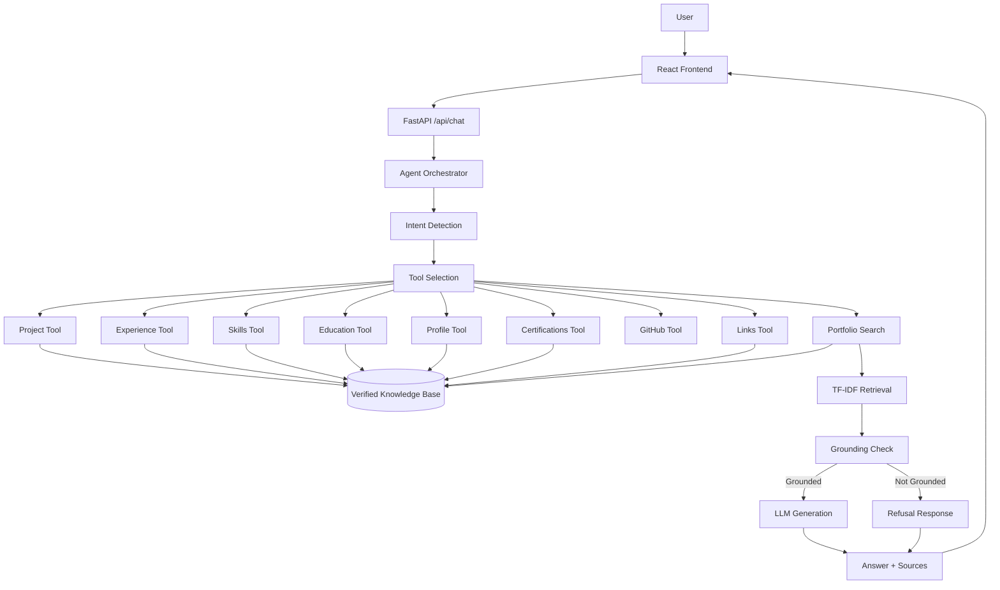

# Yash AI — Personal AI Career Agent

> A grounded AI career agent that answers questions about my education, experience, projects, skills, certifications, and GitHub activity using retrieval, typed tools, and LLM generation.

[](https://www.python.org/)
[](https://fastapi.tiangolo.com/)
[](https://react.dev/)
[](https://www.typescriptlang.org/)
[](#testing)
[](LICENSE)

---

## 🚀 Overview

**Yash AI** is my personal AI career agent and portfolio website.

Instead of connecting a language model directly to a portfolio and allowing it to answer anything, the system first identifies the user's intent, selects the appropriate tool, retrieves verified information from my portfolio knowledge base, checks whether the answer is grounded, and only then generates a response.

The system is designed around one core principle:

> **If the information is not verified, the agent should say so instead of guessing.**

The agent can answer questions about:

- 👤 Personal profile
- 🎓 Education
- 💼 Experience
- 🚀 Projects
- 🧠 Technical skills
- 📜 Certifications
- 🏆 Achievements
- 🐙 GitHub activity
- 🔗 Portfolio links
- 🤖 Career-oriented questions

---

# 🎯 Why I Built This

Most AI portfolio websites follow a simple architecture:

```text
User → LLM → Answer
```

While this is easy to implement, it can allow an LLM to generate information that does not actually exist in the portfolio.

I wanted to explore a more reliable architecture:

```text
User Query
    ↓
Intent Detection
    ↓
Tool Selection
    ↓
Verified Retrieval
    ↓
Grounding Check
    ↓
LLM / Fallback Generation
    ↓
Answer + Sources
```

The main engineering challenge was therefore not simply calling an LLM.

It was building a system that:

- knows what information it has
- retrieves the correct information
- uses specialized tools
- avoids unsupported claims
- exposes its execution pipeline
- works even when the LLM is unavailable
- keeps portfolio data separate from application logic

---

# ✨ Key Features

## 🤖 Grounded AI Career Agent

Users can ask natural-language questions such as:

```text
What is PathForge?
```

```text
What are Yash's strongest AI/ML projects?
```

```text
What technologies does Yash use?
```

```text
What is Yash's educational background?
```

```text
Tell me about Yash's internships.
```

```text
What certifications does Yash have?
```

The agent retrieves verified portfolio information before generating an answer.

---

## 🧠 Intent-Based Tool Selection

The system uses a transparent rule-based intent router.

Instead of asking an LLM to decide which tool to use, predefined patterns identify the user's intent.

Supported areas include:

- Projects
- Experience
- Skills
- Education
- Profile
- Certifications
- GitHub
- Links
- General portfolio search

This makes the routing system:

- predictable
- fast
- inexpensive
- easy to debug
- easy to test

---

## 🔎 Retrieval-Augmented Generation

The system uses a lightweight TF-IDF retrieval pipeline.

Portfolio data is converted into searchable documents and indexed using:

- Scikit-learn
- TF-IDF vectorization
- Cosine similarity

Relevant documents are retrieved and provided as verified context for the response.

---

## 🛡️ Hallucination Prevention

The agent does not allow the LLM to freely answer unsupported portfolio questions.

For example:

```text
User:
What is Yash's salary?

Agent:
I don't have verified information about that in Yash's portfolio yet.
```

If the knowledge base does not contain sufficient information, the system refuses to fabricate an answer.

The LLM is only called after relevant verified information has been retrieved.

---

## 🔄 LLM + Fallback Architecture

The LLM is optional.

When an LLM is available:

```text
Retrieved Context
      ↓
LLM Generation
      ↓
Grounded Answer
```

If the LLM is unavailable:

```text
Retrieved Context
      ↓
Fallback Composer
      ↓
Readable Answer
```

This provides graceful degradation instead of complete application failure.

---

## 🐙 GitHub Integration

The project includes a GitHub tool that can retrieve public repository information.

This allows the agent to provide information about GitHub activity using live API data.

If GitHub is unavailable, the application returns an appropriate unavailable response rather than inventing statistics.

---

## 🧩 Agent Execution Trace

The frontend can display the major stages of an agent request:

```text
Intent
   ↓
Tool Selection
   ↓
Retrieval
   ↓
Grounding
   ↓
Generation
```

This makes the system more transparent and helps demonstrate how the AI agent processes a request.

---

# 🏗️ Architecture



---

# 🔄 Agent Pipeline

Every chat request follows a structured pipeline.

## 1. Intent Detection

Implemented in:

```text
backend/app/agent/intent.py
```

The router identifies what the user is asking about.

Example:

```text
"What technologies does Yash use?"
        ↓
skills_tool
```

```text
"What is PathForge?"
        ↓
project_tool
```

```text
"What is Yash's educational background?"
        ↓
education_tool
```

```text
"Who is Yash?"
        ↓
profile_tool
```

---

## 2. Tool Selection

The router selects the appropriate tool or retrieval strategy.

Each tool has a clearly defined responsibility.

This keeps the agent modular and easier to test.

---

## 3. Tool Execution

Tools retrieve verified information from the portfolio knowledge base or external services.

Each tool returns a structured result containing:

- whether information was found
- retrieved content
- source information
- tool name

A failed lookup becomes:

```text
found = false
```

instead of an application error.

---

## 4. Retrieval

When a specialized tool is not sufficient, the agent uses the general portfolio retrieval system.

The retrieval pipeline is:

```text
JSON Data
   ↓
Documents
   ↓
TF-IDF Vectorization
   ↓
Cosine Similarity
   ↓
Top-K Relevant Documents
```

---

## 5. Grounding

Before generating an answer, the orchestrator checks whether verified information was retrieved.

If relevant information is not found:

```text
Do not call the LLM.
Return an honest "not verified" response.
```

This provides a layer of protection against unsupported AI-generated claims.

---

## 6. LLM Generation

When verified context exists, the configured LLM receives the retrieved information as context.

The LLM is instructed to stay grounded in the supplied portfolio information.

The current implementation supports OpenAI-compatible chat-completion endpoints.

---

## 7. Fallback Generation

If the LLM is unavailable or fails:

```text
Tool Result
    ↓
Fallback Composer
    ↓
Readable Answer
```

The system can still return useful portfolio information without depending entirely on an external model.

---

# 🧠 RAG Pipeline

The project intentionally uses **TF-IDF + cosine similarity** instead of a heavyweight vector database.

### Why TF-IDF?

The portfolio knowledge base is relatively small and contains mostly:

- project names
- technologies
- organizations
- skills
- education information
- certifications
- portfolio-specific terminology

For this type of knowledge base, sparse lexical retrieval provides a simple and transparent solution.

The retrieval layer is also isolated behind a dedicated interface, making it possible to replace TF-IDF with embedding-based retrieval in the future.

---

# 🧰 Agent Tools

| Tool | Purpose |
|---|---|
| `project_tool` | Retrieves information about projects |
| `experience_tool` | Retrieves internship and work experience |
| `skills_tool` | Retrieves technical skills |
| `education_tool` | Retrieves academic information |
| `profile_tool` | Retrieves verified profile information |
| `certifications_tool` | Retrieves certifications |
| `links_tool` | Returns verified portfolio links |
| `github_tool` | Retrieves public GitHub information |
| `portfolio_search` | General TF-IDF search across portfolio data |

---

# 💼 Career Modes

The agent supports multiple career-oriented modes.

## 👔 Recruiter Mode

Focuses on:

- experience
- technical skills
- projects
- career direction

## 💻 Technical Mode

Focuses on:

- technologies
- architecture
- implementation
- engineering decisions

## 🚀 Project Mode

Focuses on:

- project descriptions
- problems
- solutions
- features
- technologies

## 👤 About Mode

Focuses on:

- profile
- education
- background
- career direction

---

# 📚 Verified Portfolio Data

Portfolio information is maintained separately from application logic.

```text
data/
├── profile.json
├── education.json
├── experience.json
├── projects.json
├── skills.json
├── certifications.json
├── achievements.json
└── links.json
```

These files act as the primary source of truth for the portfolio agent.

If a fact is not present in the verified data, the agent should not invent it.

---

# 🚀 Featured Projects

## ExamLens AI

An AI-powered university exam-paper analyzer.

### Features

- Past-paper analysis
- Topic identification
- Topic heatmap
- Question prediction
- Personalized revision plans
- Formula extraction
- MCQ generation
- PDF export

### Technologies

```text
Python
Streamlit
Groq API
Llama-based LLM
```

---

## Smart Campus Sustainability Dashboard

A sustainability analytics dashboard for PSIT Kanpur.

### Features

- Energy monitoring
- Water monitoring
- Solar generation monitoring
- Anomaly detection
- Forecasting
- Department Green Scores
- Department comparison
- Sustainability analytics

### Machine Learning

```text
Isolation Forest
Prophet
Decision Tree
```

### Technologies

```text
Python
Streamlit
Scikit-learn
Prophet
```

---

## PathForge

An agentic AI career intelligence platform.

### Overview

PathForge analyzes resume/profile information and compares a user's skills with job-market requirements.

The system uses semantic retrieval to identify relevant job requirements and helps determine:

- current skill profile
- required skills
- career gaps
- transferable skills
- prioritized learning areas
- career resilience

### Technologies

```text
Python
NLP
Sentence Transformers
FAISS
DuckDB
Groq API
```

Repository:

```text
https://github.com/2k24csaiml1e2411265-wq/PathForge
```

---

# 🛠️ Tech Stack

## Frontend

- React
- TypeScript
- Vite
- Tailwind CSS
- React Router
- Lucide React

## Backend

- Python
- FastAPI
- Pydantic
- Scikit-learn
- HTTPX
- Pytest

## AI / Retrieval

- TF-IDF
- Cosine Similarity
- OpenAI-compatible LLM APIs
- Groq
- Tool-based agent architecture

## Data

- JSON
- Structured portfolio knowledge base

## External Integration

- GitHub REST API

---

# 📁 Project Structure

```text
yash-ai-personal-career-agent/
│
├── data/
│   ├── profile.json
│   ├── education.json
│   ├── experience.json
│   ├── projects.json
│   ├── skills.json
│   ├── certifications.json
│   ├── achievements.json
│   └── links.json
│
├── backend/
│   ├── app/
│   │   ├── main.py
│   │   ├── config.py
│   │
│   │   ├── agent/
│   │   │   ├── orchestrator.py
│   │   │   ├── intent.py
│   │   │   ├── modes.py
│   │   │   └── composer.py
│   │
│   │   ├── tools/
│   │   │   ├── base.py
│   │   │   ├── project_tool.py
│   │   │   ├── experience_tool.py
│   │   │   ├── skills_tool.py
│   │   │   ├── education_tool.py
│   │   │   ├── profile_tool.py
│   │   │   ├── certifications_tool.py
│   │   │   ├── github_tool.py
│   │   │   └── links_tool.py
│   │
│   │   ├── rag/
│   │   │   └── retriever.py
│   │
│   │   ├── services/
│   │   │   ├── knowledge_base.py
│   │   │   ├── llm_client.py
│   │   │   └── rate_limiter.py
│   │
│   │   ├── models/
│   │   │   └── schemas.py
│   │
│   │   └── routers/
│   │       ├── chat.py
│   │       ├── portfolio.py
│   │       ├── github.py
│   │       └── diagnostics.py
│   │
│   └── tests/
│
├── frontend/
│   ├── src/
│   │   ├── components/
│   │   ├── pages/
│   │   ├── hooks/
│   │   ├── styles/
│   │   ├── App.tsx
│   │   └── main.tsx
│   │
│   ├── package.json
│   ├── vite.config.*
│   └── tailwind.config.*
│
├── .env.example
├── .gitignore
├── CONTRIBUTING.md
├── LICENSE
└── README.md
```

---

# ⚙️ Local Setup

## 1. Clone the Repository

```bash
git clone https://github.com/2k24csaiml1e2411265-wq/yash-ai-personal-career-agent.git

cd yash-ai-personal-career-agent
```

---

# 🐍 Backend Setup

### Windows PowerShell

```powershell
cd backend

python -m venv .venv

.\.venv\Scripts\Activate.ps1

pip install -r requirements.txt
```

---

## Configure Backend Environment

Create:

```text
backend/.env
```

Example:

```env
LLM_PROVIDER=groq
MODEL_NAME=openai/gpt-oss-120b
LLM_API_KEY=your_api_key_here
LLM_BASE_URL=https://api.groq.com/openai/v1/chat/completions

LLM_TIMEOUT_SECONDS=20

GITHUB_USERNAME=your_github_username
GITHUB_TOKEN=

CORS_ORIGINS=http://localhost:5173,http://127.0.0.1:5173

RETRIEVAL_TOP_K=4
RETRIEVAL_MIN_SCORE=0.12

RATE_LIMIT_ENABLED=true
RATE_LIMIT_REQUESTS=30
RATE_LIMIT_WINDOW_SECONDS=60
```

> **Important:** Never commit your real API key. `.env` files are excluded from Git.

---

# ▶️ Run the Backend

From the `backend` directory:

```bash
uvicorn app.main:app --reload
```

Backend server:

```text
http://127.0.0.1:8000
```

FastAPI documentation:

```text
http://127.0.0.1:8000/docs
```

---

# ⚛️ Frontend Setup

Open another terminal:

```powershell
cd frontend

npm install
```

Create:

```text
frontend/.env
```

with:

```env
VITE_API_BASE_URL=http://localhost:8000
```

Run the frontend:

```powershell
npm run dev
```

Frontend:

```text
http://localhost:5173
```

---

# 🧪 Testing

The backend contains automated tests for important agent and knowledge-base behavior.

The tests cover areas including:

- Knowledge base loading
- Portfolio retrieval
- Project queries
- Technology matching
- Unknown queries
- Certifications
- Grounding behavior
- Tool behavior
- Portfolio data validation

Current validation:

```text
17 tests passing
```

Run the tests:

```bash
cd backend
pytest -q
```

For verbose output:

```bash
pytest -v
```

---

# 🏗️ Frontend Validation

Run TypeScript validation:

```bash
cd frontend
npm run lint
```

Create a production build:

```bash
npm run build
```

The production build is generated in:

```text
frontend/dist/
```

The generated build directory is ignored by Git.

---

# 🔌 API Endpoints

The backend exposes portfolio and agent endpoints including:

```text
GET  /api/health

GET  /api/profile
GET  /api/education
GET  /api/experience
GET  /api/skills
GET  /api/certifications
GET  /api/achievements

GET  /api/projects
GET  /api/projects/{id}

GET  /api/modes

POST /api/chat
```

GitHub and diagnostics functionality are also available through the backend routers.

---

# 🔐 Security

The application follows several basic security practices.

## Secrets

API keys are stored in environment variables.

```text
.env
```

is excluded from Git.

Only:

```text
.env.example
```

is committed.

---

## CORS

Backend CORS origins are configured using:

```text
CORS_ORIGINS
```

This prevents unrestricted frontend origins during local development.

---

## Rate Limiting

The chat API includes lightweight in-memory rate limiting.

Example configuration:

```env
RATE_LIMIT_ENABLED=true
RATE_LIMIT_REQUESTS=30
RATE_LIMIT_WINDOW_SECONDS=60
```

---

## No Fabricated Portfolio Data

The system is designed not to fabricate:

- employers
- salaries
- awards
- certifications
- project metrics
- project details
- GitHub statistics
- portfolio links

When information is unavailable, the agent clearly indicates that the information is not verified.

---

# 🎨 Frontend Sections

The website includes dedicated sections for:

```text
About
Education
Projects
Experience
Skills
Ask Yash AI
Certifications
GitHub
Contact
```

The AI assistant is integrated directly into the portfolio experience rather than being a separate chatbot application.

---

# 📊 Agent Observability

One of the goals of this project is to make the agent's behavior understandable.

For every request, the system can expose a trace similar to:

```text
┌──────────────────────┐
│    User Question     │
└──────────┬───────────┘
           ↓
┌──────────────────────┐
│   Intent Detection   │
└──────────┬───────────┘
           ↓
┌──────────────────────┐
│    Tool Selection    │
└──────────┬───────────┘
           ↓
┌──────────────────────┐
│      Retrieval       │
└──────────┬───────────┘
           ↓
┌──────────────────────┐
│   Grounding Check    │
└──────────┬───────────┘
           ↓
┌──────────────────────┐
│   LLM / Fallback     │
└──────────┬───────────┘
           ↓
┌──────────────────────┐
│   Answer + Sources   │
└──────────────────────┘
```

This helps with:

- debugging
- transparency
- evaluation
- understanding tool selection
- identifying retrieval failures

---

# 🧠 Design Principles

## 1. Grounding Over Creativity

The objective is not to make the agent answer every possible question.

The objective is to make it answer accurately when verified information exists.

---

## 2. Tools Over a Monolithic Prompt

Different information domains have dedicated tools.

This keeps the system modular and makes individual components easier to test.

---

## 3. Graceful Degradation

The application should remain useful when:

- the LLM API is unavailable
- GitHub is unavailable
- a lookup fails
- an external service times out

---

## 4. Transparent Agent Behavior

The execution trace makes the major stages visible:

```text
Intent
Tool Selection
Retrieval
Grounding
Generation
```

---

## 5. Structured Source of Truth

Portfolio information lives in structured JSON files instead of being hidden inside prompts.

This makes the information:

- editable
- version controlled
- testable
- retrievable
- reusable by multiple tools

---

# 📌 Current Status

## Backend

- ✅ FastAPI API
- ✅ Structured knowledge base
- ✅ TF-IDF retrieval
- ✅ Typed tools
- ✅ Intent router
- ✅ Career modes
- ✅ Agent orchestrator
- ✅ Grounding protection
- ✅ LLM integration
- ✅ LLM fallback
- ✅ GitHub integration
- ✅ Rate limiting
- ✅ Automated tests

## Frontend

- ✅ React
- ✅ TypeScript
- ✅ Vite
- ✅ Tailwind CSS
- ✅ Portfolio sections
- ✅ Project pages
- ✅ AI chat interface
- ✅ Agent execution trace
- ✅ GitHub section
- ✅ Education
- ✅ Experience
- ✅ Skills
- ✅ Certifications
- ✅ Contact / links
- ✅ Production build

## Validation

```text
Backend tests       : 17 passing
Frontend TypeScript : Passing
Frontend build      : Passing
```

---

# 🔮 Future Improvements

Potential future improvements include:

- [ ] Production deployment
- [ ] Public live demo
- [ ] Automated evaluation dashboard
- [ ] Larger evaluation dataset
- [ ] Embedding-based retrieval
- [ ] Streaming LLM responses
- [ ] Persistent conversation memory
- [ ] Advanced GitHub analytics
- [ ] Improved observability
- [ ] Monitoring and logging
- [ ] Automated portfolio data updates

---

# 📸 Screenshots

Screenshots can be added to this section once they are committed to the repository.

Recommended screenshots:

1. Home page
2. About section
3. Projects section
4. PathForge project
5. Skills section
6. Certifications
7. GitHub activity
8. Ask Yash AI
9. Agent execution trace
10. Unknown-question handling

Example:

```markdown
## Screenshots

### Home


### AI Career Agent


### Agent Execution Trace


```

---

# 🌐 Repository

GitHub:

```text
https://github.com/2k24csaiml1e2411265-wq/yash-ai-personal-career-agent
```

---

# 👨‍💻 Author

## Yash Kushwaha

**B.Tech CSE (AI & ML)**  
Pranveer Singh Institute of Technology (PSIT), Kanpur

### Interests

- Artificial Intelligence
- Machine Learning
- Generative AI
- LLM Applications
- AI Agents
- Software Engineering
- Data & ML Systems

### Connect

GitHub:

```text
https://github.com/2k24csaiml1e2411265-wq
```

LinkedIn:

```text
https://linkedin.com/in/yash-kushwaha99
```

Email:

```text
2k24.csaiml1e2411265@gmail.com
```

---

# ⭐ Project Philosophy

This project is intentionally more than a portfolio chatbot.

It combines:

```text
Portfolio Website
       +
Structured Knowledge Base
       +
Intent Routing
       +
Typed Agent Tools
       +
RAG Retrieval
       +
Grounding
       +
LLM Generation
       +
Fallback Generation
       +
GitHub Integration
       +
Agent Execution Trace
```

The architecture is built around one simple principle:

> **An AI career agent should know what it knows — and clearly admit what it doesn't.**

---

# 📄 License

This project is licensed under the MIT License.

See the [LICENSE](LICENSE) file for details.

---

⭐ If you find this project interesting, consider giving the repository a star!
