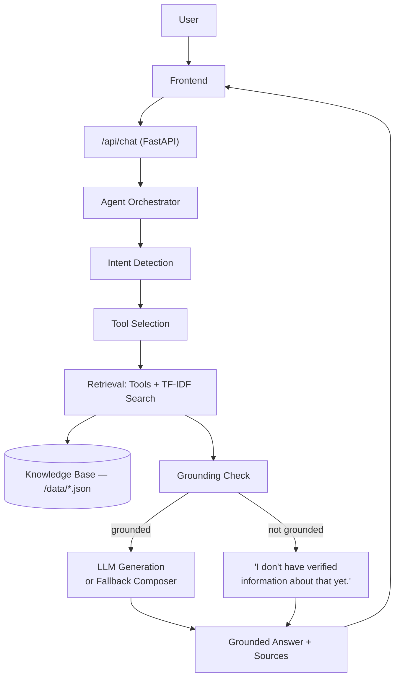

# Yash AI — Personal AI Career Agent

> An intelligent portfolio agent that understands my projects, skills, experience, and technical journey.

## ⚠️ Current status

This repository is **in progress**. What's shipped in this snapshot:

- ✅ **Backend (`backend/`)** — a real, tested FastAPI app: knowledge base loader, TF-IDF retriever, 6 typed agent tools, rule-based intent router, 4 career modes, a full orchestrator pipeline with a real execution trace, a configurable LLM client with automatic fallback, and 7 passing pytest tests.
- ✅ **Data layer (`data/`)** — the verified single-source-of-truth JSON files (profile, education, experience, projects, skills, links). TODO placeholders mark anything not yet confirmed (repo/demo links, a couple of internship tech-stack details, certifications).
- ⏳ **Frontend (`frontend/`)** — not yet built. The API is fully usable on its own via `/docs` (Swagger UI) in the meantime.
- ⏳ **Evaluation harness, full docs/ set, deployment configs** — not yet built.

The sections below describe the finished parts accurately, and flag what's still ahead. See [Roadmap](#roadmap) at the bottom for what's next.

---

## Overview

Yash AI is a personal career agent grounded entirely in a verified knowledge base about Yash Kushwaha — no invented metrics, employers, awards, or statistics. If a question can't be answered from verified data, the agent says so instead of guessing.

## Why I built this

Most "AI portfolio chatbots" are a thin wrapper around a raw LLM call, which means they'll happily hallucinate an answer to anything. The interesting engineering problem here isn't "call an LLM" — it's building a pipeline that only answers from real information, tells you *why* it believes something (sources), and still works with zero API key configured.

## Architecture



## AI architecture (agent)

Each chat request goes through `backend/app/agent/orchestrator.py`:

1. **Intent detection** (`agent/intent.py`) — a transparent, rule-based router. For a knowledge base this small (one person's projects/skills/experience), the query vocabulary is predictable enough that keyword/pattern matching is faster, cheaper, and easier to audit than a second LLM call for tool selection — and critically, it still works with **zero LLM configured**.
2. **Career modes** (`agent/modes.py`) — Recruiter / Technical / Project / About. Each mode reorders tool priority, changes the system-prompt tone, and supplies different suggested follow-up questions.
3. **Tool execution** (`app/tools/`) — typed, individually testable tools: `project_tool`, `experience_tool`, `skills_tool`, `links_tool`, `github_tool` (live GitHub API), and `portfolio_search` (the general-purpose retrieval fallback). Every tool returns `found=False` on a miss rather than raising — that's what powers honest "I don't know" answers.
4. **Retrieval** (`rag/retriever.py`) — see [RAG pipeline](#rag-pipeline) below.
5. **Grounding check** — if no tool returned verified content, the agent refuses rather than falling back to the LLM's general knowledge.
6. **Generation** — if an LLM is configured (`services/llm_client.py`), it's called with the retrieved context injected into the system prompt and instructed not to use outside knowledge. If no LLM is configured, or the call fails for any reason, `agent/composer.py` composes a readable answer directly from the retrieved text — no crash, no silent hallucination.
7. **Trace** — every stage above is recorded as a `TraceStep` (`intent`, `tool_selection`, `retrieval`, `grounding`, `generation`) and returned in the API response, so a UI can show *truthfully* what the agent actually did.

## RAG pipeline

**Design decision:** this uses `scikit-learn`'s TF-IDF vectorizer + cosine similarity instead of `sentence-transformers` + FAISS.

For a knowledge base of a few dozen short documents describing one person's projects, skills, and experience — vocabulary that's small, technical, and mostly proper nouns (project names, technology names) — a neural embedding model adds real cost (large model download, slower cold start) for no measurable retrieval-quality benefit; this is exactly the regime where sparse lexical retrieval is strong. The retriever sits behind a small interface (`TfidfRetriever` in `rag/retriever.py`) specifically so it can be swapped for embeddings later if the knowledge base grows much larger.

Pipeline: `data/*.json` → chunked into `Document`s (one per project, per experience entry, per skill category, etc.) → TF-IDF vectorized once at startup → cosine similarity search per query → top-k chunks above a minimum score → handed to the LLM or fallback composer as verified context.

## Agent tools

| Tool | Purpose |
|---|---|
| `project_tool` | Look up a specific project by name, or by technology mentioned in the query |
| `experience_tool` | Look up internship/work experience, optionally filtered by organization |
| `skills_tool` | Look up technical skills, optionally filtered by category |
| `links_tool` | Return verified GitHub/LinkedIn/email/resume links — never fabricates a URL |
| `github_tool` | Fetch **live** public repo data from the GitHub REST API, with a graceful "unavailable" response (never fake stats) if the call fails |
| `portfolio_search` | General-purpose TF-IDF search across the whole knowledge base — the safety net when nothing more specific matches |

## Unknown-question handling

If no tool returns verified content, the agent responds:

> "I don't have verified information about that in Yash's portfolio yet."

This is enforced structurally, not just by prompting: the LLM is only ever called when grounded context already exists, and the fallback composer has no path to synthesize an answer without it.

## Tech stack

- **Backend:** Python, FastAPI, scikit-learn (TF-IDF retrieval), httpx, pytest
- **LLM:** configurable via `LLM_PROVIDER` / `LLM_API_KEY` / `MODEL_NAME` — any OpenAI-compatible chat-completions endpoint (Groq, OpenAI, Together, etc.). Fully optional; the app runs in fallback mode without it.
- **Frontend (planned):** React + TypeScript + Vite + Tailwind CSS

## Local setup

```bash
# 1. Clone and enter the repo
git clone <your-repo-url>
cd yash-ai

# 2. Backend
cd backend
python3 -m venv .venv && source .venv/bin/activate   # optional but recommended
pip install -r requirements.txt
cp ../.env.example .env       # edit if you want to configure an LLM

# 3. Run the API
uvicorn app.main:app --reload
# → http://127.0.0.1:8000/docs for interactive API docs
```

### Environment variables

See [`.env.example`](.env.example) for the full list. Nothing is required to run — every `LLM_*` variable can be left blank and the agent runs in fallback mode.

## Running the tests

```bash
cd backend
pytest tests/ -v
```

At the time of this snapshot: **7/7 tests passing**, covering knowledge base loading, document indexing, and project lookup (exact id, full-sentence mention, unknown query, technology match).

## Project structure

```
yash-ai/
├── data/                  # single source of truth — profile, education, experience, projects, skills, links
├── backend/
│   ├── app/
│   │   ├── main.py        # FastAPI app entrypoint
│   │   ├── config.py      # env-driven settings
│   │   ├── agent/         # orchestrator, intent router, career modes, fallback composer
│   │   ├── tools/         # typed agent tools
│   │   ├── rag/           # TF-IDF retriever
│   │   ├── services/      # knowledge base loader, LLM client, rate limiter
│   │   ├── models/        # Pydantic schemas
│   │   └── routers/       # /api/chat, /api/projects, /api/github, /api/diagnostics, ...
│   └── tests/
├── frontend/               # not yet built
├── evaluation/              # not yet built
├── docs/                    # not yet built
├── .env.example
├── LICENSE
└── README.md (this file)
```

## Security

- No secrets committed — `.env` is gitignored, `.env.example` documents the shape only.
- CORS restricted to configured origins (`CORS_ORIGINS`).
- Lightweight in-memory rate limiting on `/api/chat` (`services/rate_limiter.py`).
- Tools never raise on bad input — a failed lookup degrades to "not found" instead of a 500.

## Roadmap

- [ ] React + TypeScript + Vite + Tailwind frontend (hero, project detail pages, chat UI with live trace, dark/light theme)
- [ ] Evaluation harness (`evaluation/questions.json` + `evaluate.py`) with real, run metrics — not invented ones
- [ ] `docs/` deep-dives (architecture, agent-design, rag-design, evaluation, deployment, development)
- [ ] Deployment configs (frontend on Vercel-equivalent, backend on Render/Railway-equivalent)
- [ ] Fill remaining `TODO` placeholders (repo/demo links per project, a couple of internship tech-stack details, certifications)

## License

MIT — see [LICENSE](LICENSE).
